# Prashikshan – Academia Industry Interface Platform

<div align="center">


**India's #1 Academia-Industry Interface Platform**

*Bridging Students, Academia, and Industry for Skill-Driven Careers*

[Live Demo](#) · [Documentation](#) · [Report Bug](#) · [Request Feature](#)

</div>

---

## 📋 Table of Contents

- [Overview](#-overview)
- [Screenshots](#-screenshots)
- [Features](#-features)
- [Tech Stack](#-tech-stack)
- [Pages & Modules](#-pages--modules)
- [Getting Started](#-getting-started)
- [Platform Statistics](#-platform-statistics)
- [Contributing](#-contributing)
- [License](#-license)

---

## 🌟 Overview

**Prashikshan** is a comprehensive, enterprise-grade Academia-Industry Collaboration Platform that connects students, educational institutions, faculty, industry partners, mentors, alumni, and recruiters into a **unified ecosystem** for internships, placements, skill development, mentorship, industry projects, training programs, and career advancement.

The platform is designed to look and feel as polished as **LinkedIn + Coursera + Microsoft Learn + Salesforce** — built for India's rapidly growing student and industry ecosystem.

> 💡 **Single File Deployment**: The entire platform is packaged as a single, self-contained `prashikshan.html` file — no build step, no server required. Just open in any modern browser.

---

## 📸 Screenshots

### 🏠 Landing Page — Hero Section

The landing page features an animated hero section with a live dashboard preview, animated statistics counters, and clear CTAs for students and industry partners.

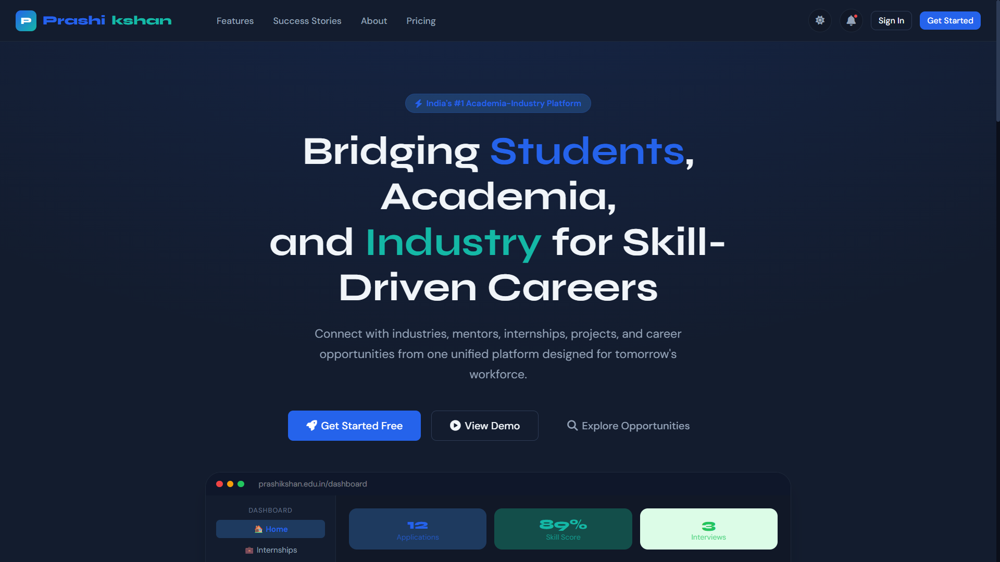

*Hero section with animated counters: 100k+ Students, 500+ Colleges, 1,000+ Industry Partners, 50k+ Internships, 25k+ Placements*

---

### 📝 Registration & Authentication

Multi-role registration with 6 distinct user types: Student, Faculty, Industry, Mentor, TPO, and Admin. Supports Google and Microsoft SSO.

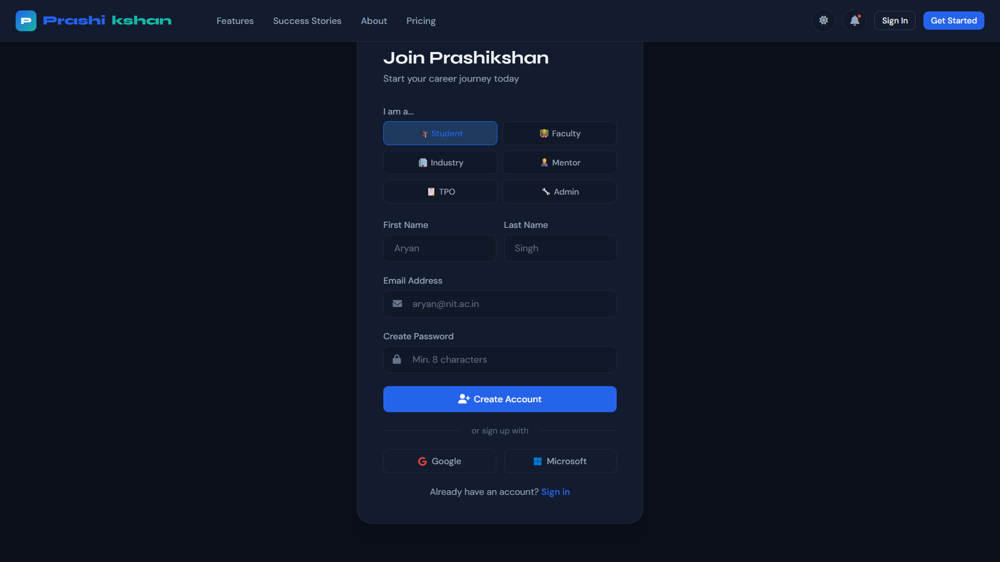

*Role-based registration with social auth (Google / Microsoft) support*

---

### 📊 Student Dashboard

A comprehensive career-tracking dashboard featuring real-time stats, application activity charts, profile completion meter, skill distribution radar, recommended internships, and quick-action buttons.

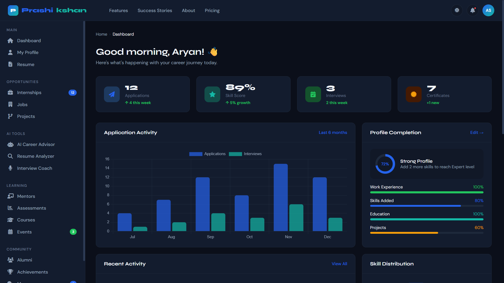

*Main dashboard: Application Activity chart, Profile Completion, Recent Activity, Skill Distribution, Upcoming Events*

---

### 👤 Student Profile

A LinkedIn-style professional profile with education timeline, experience, projects, certifications, skill chips, and downloadable resume. Full edit capabilities included.

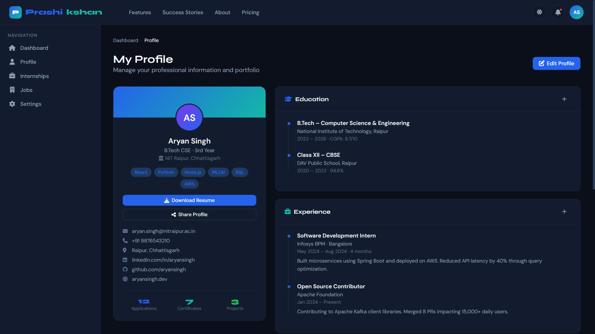

*Professional profile with education, experience, projects, certifications, and contact info*

---

### 💼 Internship Portal

Browse 12,450+ active internships with AI-powered matching scores. Advanced filters for location, work mode, stipend, duration, and industry. Built-in application tracker with status updates.

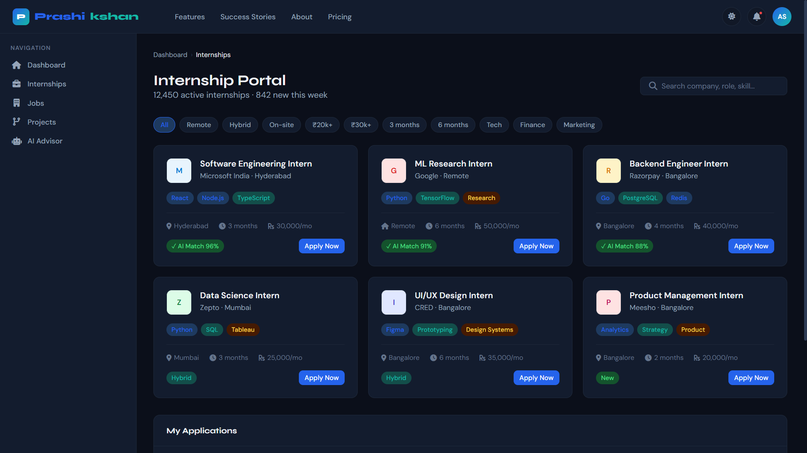

*Internship listings with AI Match scores (96%, 91%, 88%), company logos, tags, and one-click Apply Now*

---

### 🏢 Job Portal

LinkedIn-inspired job portal with AI-matched job recommendations. Filter by CTC range, experience level, work mode, and domain. Dedicated views for fresh graduates.

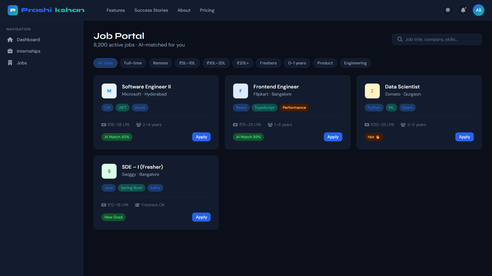

*Job cards with AI match percentages, CTC ranges, experience requirements, and skill tags*

---

### 🛠️ Industry Project Marketplace

Real-world industry projects from top companies (HUL, HDFC Bank, Apollo Hospitals) mentored by IIT/IIM faculty. Team formation and project tracking included.

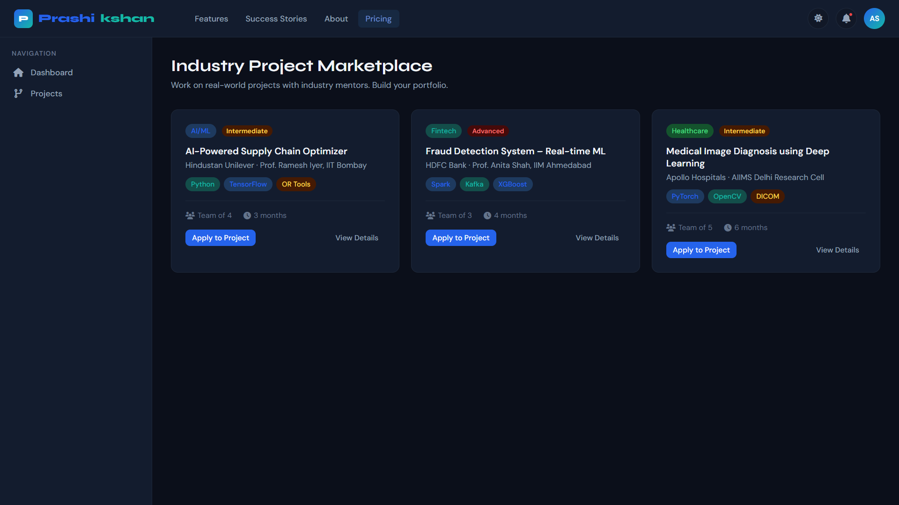

*Project marketplace with difficulty ratings, tech stacks, team sizes, and mentor details*

---

### 🤖 AI Career Advisor

A conversational AI career advisor with pre-built prompts for skill gap analysis, career roadmaps, FAANG interview tips, and personalized guidance. Powered by a ChatGPT-like interface.

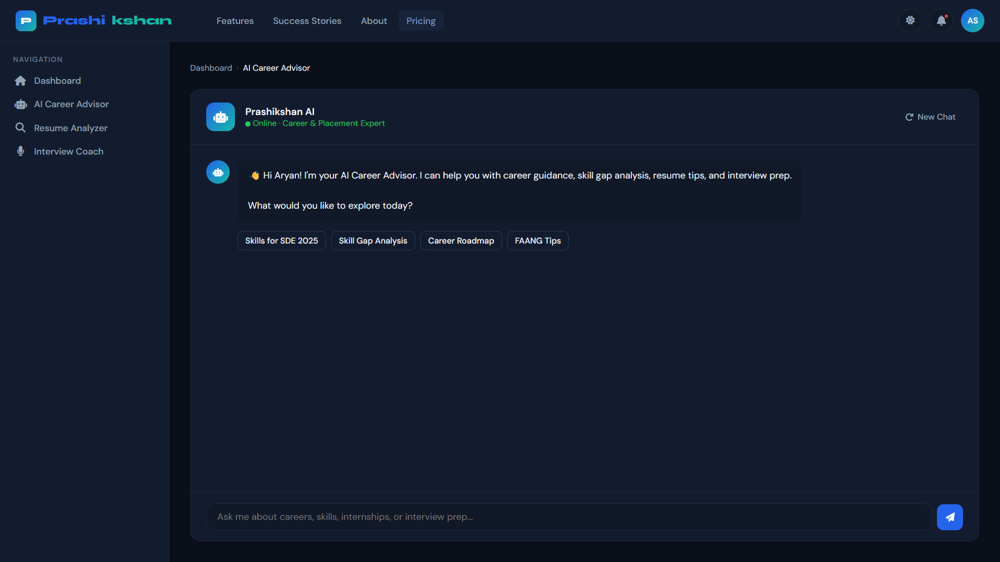

*AI chat interface with quick-prompt buttons: Skills for SDE 2025, Skill Gap Analysis, Career Roadmap, FAANG Tips*

---

### 📄 AI Resume Analyzer

Upload your resume and get instant ATS compatibility scores, JD match percentage, format score, skill gap identification, and AI-powered improvement suggestions.

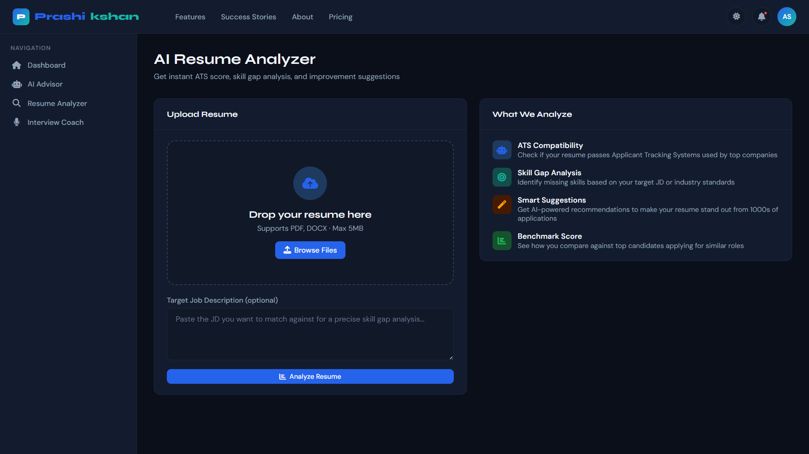

*Resume upload zone with JD input for targeted analysis; shows ATS Score, JD Match, and Format Score*

---

### 🎤 AI Interview Coach

Practice mock interviews with AI using configurable interview types (Technical, HR, System Design) and difficulty levels. Track performance history across multiple rounds.

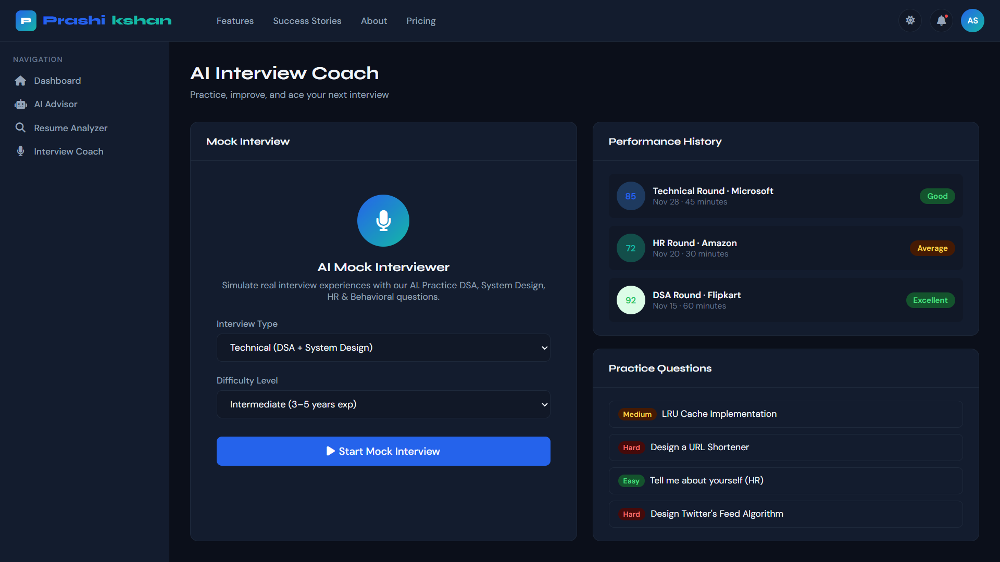

*Mock interview setup with performance history (scores: 85, 72, 92) and practice question bank*

---

### 👨‍🏫 Mentorship Hub

Connect with 500+ industry experts from Google, Microsoft, Amazon, Razorpay, and more. View mentor profiles with ratings, session counts, skill areas, and book sessions instantly.

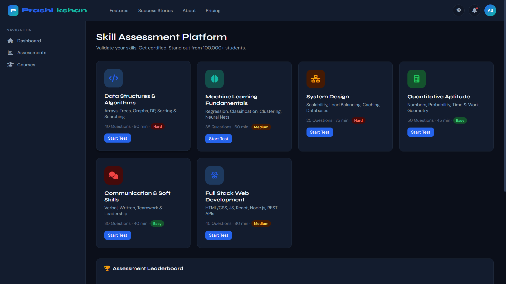

*Mentor cards with avatars, company logos, skill tags, star ratings, session counts, and Book/Message CTAs*

---

### 📐 Skill Assessment Platform

Industry-validated assessments across DSA, ML, System Design, Aptitude, Soft Skills, and Full Stack. Timed tests with live leaderboard rankings and percentile scores.

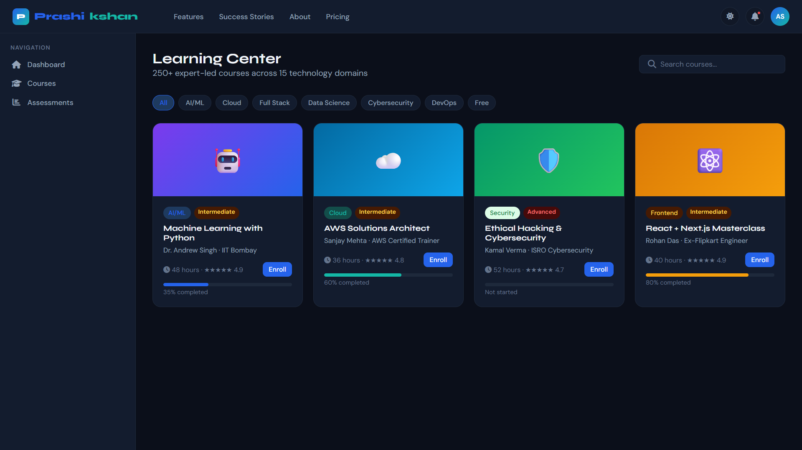

*Assessment grid with difficulty levels (Easy/Medium/Hard), question counts, time limits, and a college leaderboard*

---

### 🎓 Learning Center (LMS)

250+ expert-led video courses across AI/ML, Cloud, Cybersecurity, Full Stack, and more. Progress tracking per course, instructor profiles, ratings, and enrollment CTAs.


*Course cards with colorful banners, progress bars, ratings, and category/difficulty badges*

---

### 📅 Events & Opportunities

Discover upcoming hackathons, webinars, workshops, placement drives, and industrial visits. Register, RSVP, or enroll — all from one unified calendar view.

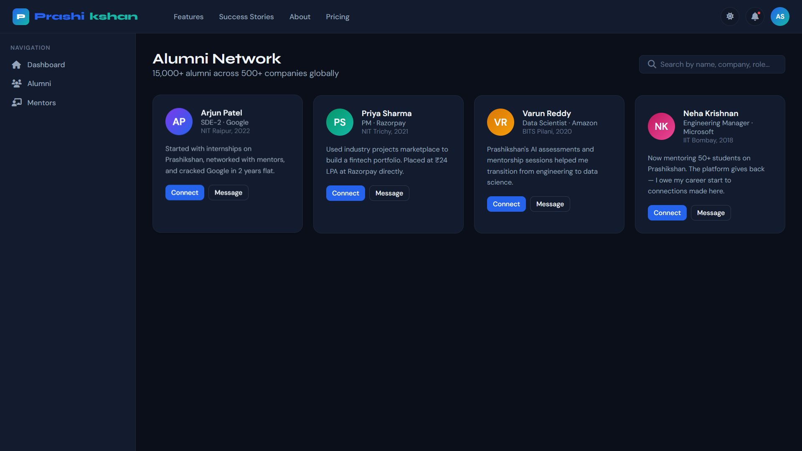

*Event grid: Smart India Hackathon 2025, FAANG webinar, TCS Campus Drive, Infosys Lab Tour, PM Bootcamp, GenAI Webinar*

---

### 🤝 Alumni Network

LinkedIn-style alumni directory featuring 15,000+ alumni across 500+ global companies. Connect, message, and get referrals from successful graduates.

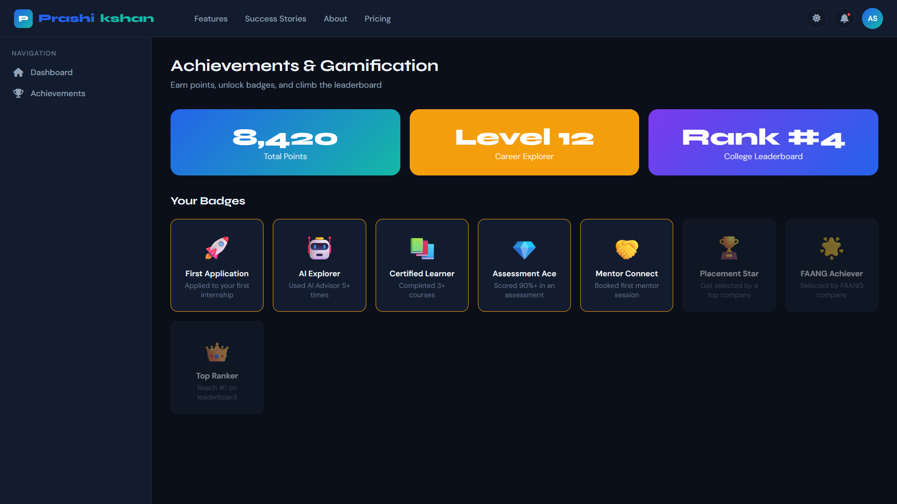

*Alumni cards with current roles (Google SDE-2, Razorpay PM, Amazon Data Scientist, Microsoft EM) and journey stories*

---

### 🏆 Achievements & Gamification

Earn points, unlock badges, level up, and climb your college leaderboard. Visual achievement cards for First Application, AI Explorer, Assessment Ace, FAANG Achiever, and more.

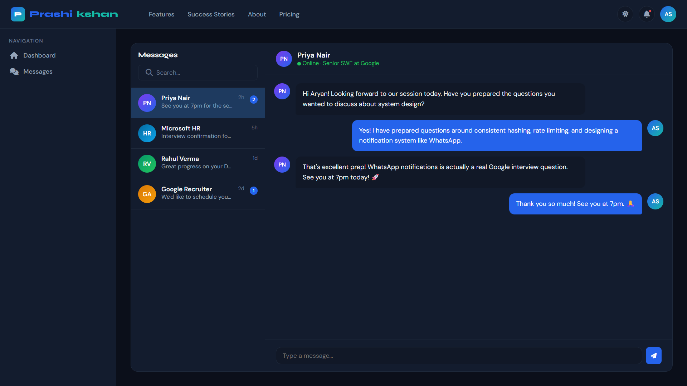

*8,420 points · Level 12 Career Explorer · Rank #4 on leaderboard · 5 earned badges + 3 locked badges*

---

### 💬 Messages

Real-time messaging between students, mentors, and recruiters. Conversation list with unread indicators, message bubbles, and online presence status.

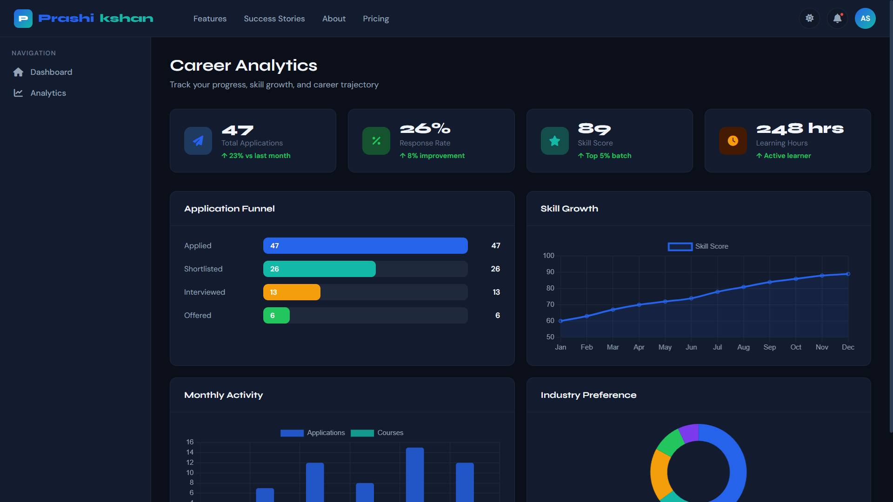

*Chat interface with Priya Nair (Google SWE) — conversation about upcoming mentorship session*

---

### 📈 Career Analytics

Comprehensive career tracking with an application funnel visualization, skill growth line chart, monthly activity bar chart, and industry preference doughnut chart.

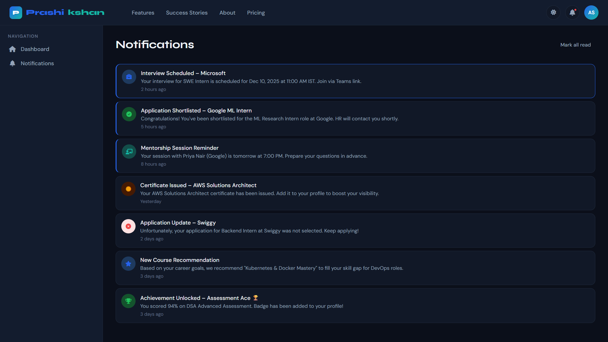

*Analytics dashboard: Application funnel (47→26→13→6), Skill Growth chart (60→89 over 12 months), Industry Preference*

---

### 🔔 Notifications

Centralized notification center with unread indicators. Categories include interview schedules, shortlist updates, mentorship reminders, certificate issuance, and achievements.


*7 notification types with left-border unread indicators: Interview Scheduled, Shortlisted, Session Reminder, Certificate, etc.*

---

## ✨ Features

### For Students
- 🎯 **AI Career Advisor** — Personalized guidance, skill gap analysis, career roadmaps
- 📄 **AI Resume Analyzer** — ATS score, JD match, improvement suggestions
- 🎤 **AI Interview Coach** — Mock interviews with performance scoring
- 💼 **Internship Portal** — 12,450+ listings with AI match scores
- 🏢 **Job Portal** — 8,200+ AI-matched jobs with CTC details
- 👨‍🏫 **Mentorship Hub** — Book sessions with 500+ industry mentors
- 📐 **Skill Assessments** — Timed tests with leaderboard rankings
- 🎓 **Learning Center** — 250+ expert-led courses with progress tracking
- 📅 **Events** — Hackathons, webinars, placement drives
- 🏆 **Gamification** — Points, badges, levels, leaderboards

### For Industry
- 📋 **Post Internships & Jobs** — Reach 100,000+ verified students
- 🔍 **Candidate Search** — Filter by skills, CGPA, college, location
- 📊 **Hiring Analytics** — Application funnel, pipeline, offer statistics
- 🤝 **Project Marketplace** — Sponsor real-world projects with academic mentors

### For Institutions
- 📊 **Placement Analytics** — Placement rate, hiring trends, company reports
- 👩‍🏫 **Faculty Dashboard** — Student monitoring, internship evaluation
- 🏫 **Admin Panel** — User management, content moderation, audit logs

---

## 🛠️ Tech Stack

| Layer | Technology |
|-------|------------|
| **Frontend** | HTML5, CSS3, Vanilla JavaScript |
| **Fonts** | Syne (headings), DM Sans (body) via Google Fonts |
| **Icons** | Font Awesome 6.5.0 |
| **Charts** | Chart.js 4.4.1 (Bar, Radar, Line, Doughnut) |
| **Theme** | CSS Custom Properties (light + dark mode) |
| **Deployment** | Single `.html` file — zero build step |

### Design System

```
Primary:    #2563EB  (Blue)
Secondary:  #0F172A  (Navy)
Accent:     #14B8A6  (Teal)
Success:    #22C55E  (Green)
Warning:    #F59E0B  (Amber)
Danger:     #EF4444  (Red)
Background: #F8FAFC  (Light) / #0B0F1A (Dark)
```

---

## 📦 Pages & Modules

| Page | Route | Description |
|------|-------|-------------|
| Landing | `#landing` | Hero, features, testimonials, CTA, footer |
| Login | `#login` | Email/password + Google/Microsoft SSO |
| Register | `#register` | Multi-role registration (6 roles) |
| Forgot Password | `#forgot-password` | OTP-based password reset |
| Student Dashboard | `#student-dashboard` | Charts, stats, activity, quick actions |
| Profile | `#profile` | Education, experience, projects, certifications |
| Internships | `#internships` | Browse + filter + application tracker |
| Jobs | `#jobs` | AI-matched job listings |
| AI Career Advisor | `#ai-advisor` | Conversational AI career guidance |
| Resume Analyzer | `#resume-analyzer` | ATS score + skill gap + suggestions |
| Interview Coach | `#interview-coach` | Mock interviews + practice questions |
| Mentorship | `#mentorship` | Browse mentors + book sessions |
| Projects | `#projects` | Industry project marketplace |
| Assessments | `#assessments` | Skill tests + leaderboard |
| Learning Center | `#lms` | Course catalog + progress tracking |
| Events | `#events` | Hackathons, webinars, drives |
| Alumni Network | `#alumni` | Alumni directory + connect |
| Gamification | `#gamification` | Badges, points, levels, leaderboard |
| Analytics | `#analytics` | Career progress charts |
| Notifications | `#notifications` | All platform notifications |
| Messages | `#messages` | Real-time chat interface |
| Settings | `#settings` | Profile, notifications, appearance |
| Industry Dashboard | `#industry-dashboard` | Hiring funnel + top applications |
| Admin Panel | `#admin` | Platform-wide KPIs + activity log |

---

## 🚀 Getting Started

### Option 1 — Open Directly (Recommended)

```bash
# No installation required!
# Simply open the file in any modern browser:
open prashikshan.html
```

### Option 2 — Serve Locally

```bash
# Python 3
python -m http.server 8000

# Node.js
npx serve .

# Then open: http://localhost:8000/prashikshan.html
```

### Demo Navigation

| Action | Result |
|--------|--------|
| Click **Get Started** or **View Demo** | Opens Student Dashboard (auto-login) |
| Click **Sign In** | Opens Login page |
| Press `Escape` | Returns to Landing page |
| Click 🌙 (moon icon) | Toggles Dark / Light mode |
| Click sidebar items | Navigate between pages |

---

## 📊 Platform Statistics

| Metric | Count |
|--------|-------|
| 🎓 Students | 1,00,000+ |
| 🏫 Colleges | 500+ |
| 🏢 Industry Partners | 1,000+ |
| 💼 Internships Posted | 50,000+ |
| 🎯 Placements | 25,000+ |
| 👨‍🏫 Mentors | 500+ |
| 📚 Courses | 250+ |
| 🏆 Alumni | 15,000+ |

---

## 🎨 Design Highlights

- **Dark Mode** — Full dark/light theme toggle with smooth transitions
- **Responsive** — Mobile-first, works on 320px to 4K displays
- **Animations** — Fade-up page animations, counter animations, hover effects
- **Charts** — Bar, Radar, Line, and Doughnut charts with theme-aware colors
- **AI Chat** — Functional AI advisor with pre-built responses for common queries
- **Gamification** — Points, badges, levels, and leaderboards
- **Breadcrumbs** — All pages include navigational breadcrumbs
- **Status Badges** — Color-coded application statuses (Applied, Shortlisted, Interview, Selected, Rejected)

---

## 🤝 Contributing

Contributions are welcome! Please feel free to submit a Pull Request.

1. Fork the repository
2. Create your feature branch (`git checkout -b feature/AmazingFeature`)
3. Commit your changes (`git commit -m 'Add some AmazingFeature'`)
4. Push to the branch (`git push origin feature/AmazingFeature`)
5. Open a Pull Request

---

## 📄 License

This project is licensed under the MIT License — see the [LICENSE](LICENSE) file for details.

---

## 🙏 Acknowledgements

- [Font Awesome](https://fontawesome.com) — Icons
- [Google Fonts](https://fonts.google.com) — Syne & DM Sans typefaces
- [Chart.js](https://chartjs.org) — Data visualizations
- [Anthropic Claude](https://anthropic.com) — AI-assisted development

---

<div align="center">

**Made with ❤️ in India**

© 2025 Prashikshan Technologies Pvt. Ltd. All rights reserved.

[Website](#) · [LinkedIn](#) · [Twitter](#) · [YouTube](#)

</div>
